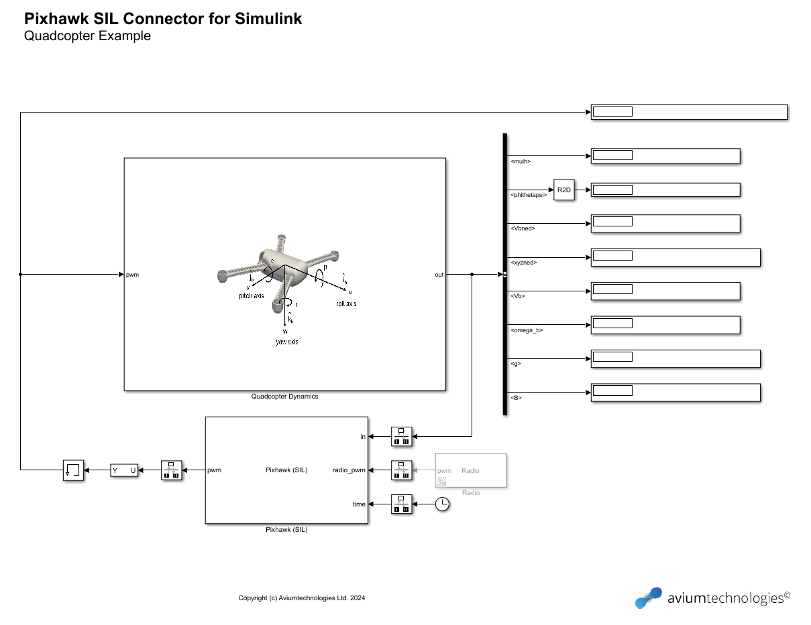

# Pixhawk SIL Connector for Simulink

Simulink C++ S-function for software-in-the-loop simulation with Pixhawk. More information available at [
https://fst.aviumtechnologies.com/pixhawk-sil-connector](
https://fst.aviumtechnologies.com/pixhawk-sil-connector)

## Requirements

- Windows (or later)
- MATLAB & Simulink (MATLAB R2022a or later)
- MSVC (Microsoft Visual C++ 2022 or later)
- QGroundControl
- PX4-Autopilot source code (the latest stable release v1.15.0) \
https://github.com/PX4/PX4-Autopilot/releases/tag/v1.15.0
- Windows Subsystem for Linux (WSL 2) \
https://learn.microsoft.com/en-us/windows/wsl/about

Note: Tested on Windows 10 with MATLAB R2022a and MSVC compiler.

## Files

[pixhawk_sil_connector.cpp](https://github.com/aviumtechnologies/pixhawk-sil-connector/blob/master/pixhawk_sil_connector.cpp)

[make.m](https://github.com/aviumtechnologies/pixhawk-sil-connector/blob/master/make.m)

[includes.zip](https://github.com/aviumtechnologies/pixhawk-sil-connector/blob/master/includes.zip) (contains the Asio C++ and MAVLink C libraries)

## MEX build instructions

-  Install MATLAB-supported compiler  
https://mathworks.com/support/requirements/supported-compilers.html.
-  Download the "pixhawk_sil_connector.cpp" and "make.m" files and the "includes.zip" archive.
-  Unzip the "includes.zip archive".
-  Run "make.m" to compile the "pixhawk_sil_connector.cpp" file. If successfull a "pixhawk_sil_connector.mexw64" will be created.

**Note:** If you are using a compiler other than MSVC (e.g. MinGW64) you might need to add the -lws2_32 flag to the "mex" command in the "make.m" file.

## Use instructions (Simulink model running in Windows, PX4 Autopilot running in WSL 2)

- Download and install QGroundControl for Windows [https://docs.qgroundcontrol.com/master/en/getting_started/download_and_install.html](https://docs.qgroundcontrol.com/master/en/getting_started/download_and_install.html).
- Create a new "Comm Link" in QGroundControl via the "Application Settings" page. The type of the link must be UDP, thed port 18570, and the server address must be the ip address of the WLS 2 instance. You can use the "ip addr" command to find the ip of the WSL 2 instance. Note that the ip of the WSL  isntance will change every time you relaunch the instance.
- Open and run "pixhawk_sil_connector_example.slx".
- Build the PX4-Autopilot source code in WSL 2 using the following commands:  <pre>
git clone --recursive https://github.com/PX4/PX4-Autopilot
cd PX4-Autopilot
git checkout v1.15.0
git submodule sync --recursive
git submodule update --init --recursive
make px4_sitl_default</pre>  [https://docs.px4.io/master/en/dev_setup/building_px4.html](https://docs.px4.io/master/en/dev_setup/building_px4.html) \
[https://docs.px4.io/main/en/simulation/](https://docs.px4.io/main/en/simulation/).

- If you already have a build of the PX4-Autopilot source code start PX4 using the following commands: <pre>
cd build/px4_sitl_default
export PX4_SIM_HOST_ADDR=172.x.x.x (the ip address of WSL 2)
export PX4_SIM_MODEL=none_iris
./bin/px4 -s etc/init.d-posix/rcS
</pre>

Demonstration of the Pixhawk SIL connector example

Pixhawk SIL connector example

Pixhawk SIL connector example SITL subsystem

## Simulink Coder build instructions

To build an executable of the Pixhawk SIL connector example, open the Sumlink Coder application and select the Generate Code option. Make sure that in the configuration parameters window under code generation, the system target file is grt.tlc, the language is C++ and the language standard is C++11 (ISO). The generate code only must be checked under the build process parameters. 

After you select the generate code option, the code generation will pause at the "Initialization" phase. This is expected as the model tries to connect to PX4. To continue with the code generation you need to start PX4 using the following command:

<pre>
cd build/px4_sitl_default
export PX4_SIM_HOST_ADDR=172.x.x.x (the ip address of WSL 2)
export PX4_SIM_MODEL=none_iris
./bin/px4 -s etc/init.d-posix/rcS</pre>

The phase will then change to "Building" and then "Ready". At that point you can stop PX4. 

The code for the Pixhawk SIL connector example will be generated in the `pixhawk_sil_connector_example_grt_rtw` folder. Unforutnately simulation pacing (required for real-time execution) is not supported by Simulink Coder. Therefore a custom version of `rt_main.cpp` file is required to achive real-time execution of the model.

- Edit the `pixhawk_sil_connector_example.mk` in the `pixhawk_sil_connector_example_grt_rtw` folder by replacing `$(MATLAB_ROOT)\rtw\c\src\common\rt_main.cpp` with `$(START_DIR)\pixhawk_sil_connector_example_grt_rtw\rt_main.cpp`.
- Copy the `rt_main.cpp` file from the `$(MATLAB_ROOT)\rtw\c\src\common\` folder to the `$(START_DIR)\pixhawk_sil_connector_example_grt_rtw\` folder.
- Edit the `int_T main(int_T argc, const char *argv[])` function in the `rt_main.cpp` file to achieve real-time execution. You can use the standard C++ library `<thread>` and `<chrono>`. 

    **Note:** It is beyond the scope of this instructions explain how this is done.
- Build the generated code with the following command `nmake -f pixhawk_sil_connector_example.mk all`

After succesfull build a `pixhawk_sil_connector_example.exe` file will be created.
