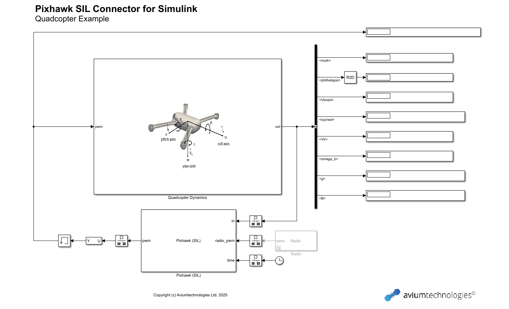
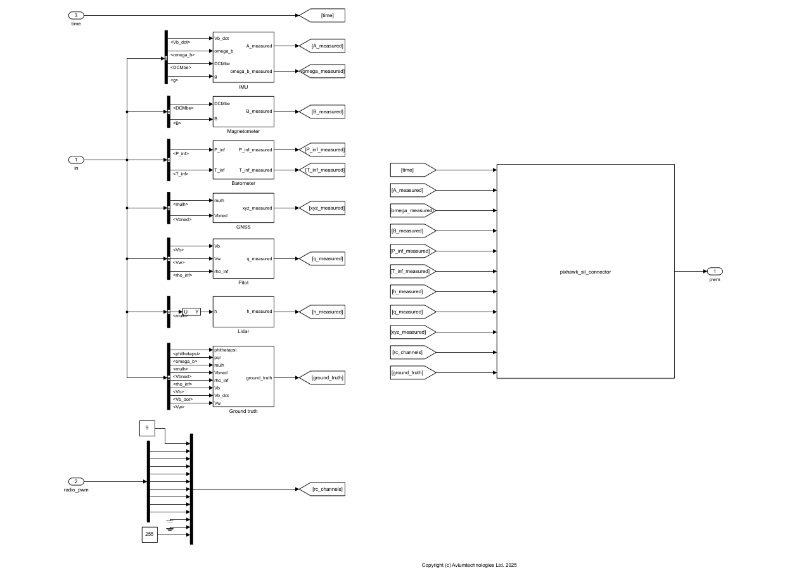

# Pixhawk SIL Connector for Simulink

Simulink C++ S-function for software-in-the-loop simulation with Pixhawk. More information available at [
https://fst.aviumtechnologies.com/pixhawk-sil-connector](
https://fst.aviumtechnologies.com/pixhawk-sil-connector)

## Requirements

- MATLAB & Simulink (MATLAB R2022a or later)
- MSVC C/C++ (recommended) or MinGW-w64 compiler
- QGroundControl
- PX4-Autopilot source code (the latest stable release v1.15.0) \
https://github.com/PX4/PX4-Autopilot/releases/tag/v1.15.0
- Windows Subsystem for Linux (WSL 2) \
https://learn.microsoft.com/en-us/windows/wsl/about

Note: Tested extensively on Windows with MSVC C/C++ compiler.

## Files

[pixhawk_sil_connector.cpp](https://github.com/aviumtechnologies/pixhawk-sil-connector/blob/master/pixhawk_sil_connector.cpp)

[make.m](https://github.com/aviumtechnologies/pixhawk-sil-connector/blob/master/make.m)

[includes.zip](https://github.com/aviumtechnologies/pixhawk-sil-connector/blob/master/includes.zip) (contains the Asio C++ and MAVLink C libraries)

## Build instructions

-  Install MATLAB-supported compiler  
https://mathworks.com/support/requirements/supported-compilers.html.
-  Download the "pixhawk_sil_connector.cpp" and "make.m" files and the "includes.zip" archive.
-  Unzip the "includes.zip archive".
-  Run "make.m" to compile the "pixhawk_sil_connector.cpp" file. If successfull a "pixhawk_sil_connector.mexw64" will be created.

Note: If you are using a compiler other than MSVC (e.g. MinGW64) you might need to add the -lws2_32 flag to the "mex" command in the "make.m" file.

## Use instructions (Simulink model running in Windows, PX4 Autopilot running in WSL 2)

- Download and install QGroundControl for Windows [https://docs.qgroundcontrol.com/master/en/getting_started/download_and_install.html](https://docs.qgroundcontrol.com/master/en/getting_started/download_and_install.html).
- Create a new "Comm Link" in QGroundControl via the "Application Settings" page. The type of the link must be UDP, thed port 18570, and the server address must be the ip address of the WLS 2 instance. You can use the "ip addr" command to find the ip of the WSL 2 instance. Note that the ip of the WSL  isntance will change every time you relaunch the instance.
- Open and run "pixhawk_sil_connector_example.slx".
- Build the PX4-Autopilot source code in WSL 2 using the following commands:  <pre>
git clone --recursive https://github.com/PX4/PX4-Autopilot
cd PX4-Autopilot
git checkout v1.15.0
git submodule sync --recursive
git submodule update --init --recursive
make px4_sitl_default</pre>  [https://docs.px4.io/master/en/dev_setup/building_px4.html](https://docs.px4.io/master/en/dev_setup/building_px4.html) \
[https://docs.px4.io/main/en/simulation/](https://docs.px4.io/main/en/simulation/).

- If you already have a build of the PX4-Autopilot source code start PX4 using the following commands: <pre>
cd build/px4_sitl_default
export PX4_SIM_HOST_ADDR=x.x.x.x #(the ip of the computer running the Simulink model)
export PX4_SIM_MODEL=model (iris for v1.13.3 or none_iris for v1.14.0 and v1.15.0)
./bin/px4 -s etc/init.d-posix/rcS
</pre>

Demonstration of the Pixhawk SIL connector example

Pixhawk SIL connector example

Pixhawk SIL connector example SITL subsystem

